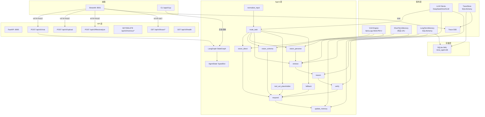

# 项目规范：Nexa Agent V0

> 版本：V1.0 | 日期：2026-06-09 | 状态：V0 功能完成，V1 规划中

---

## 1. 项目愿景与核心价值

### 1.1 Nexa Agent V0 是什么

Nexa Agent V0 是一个 **LangGraph 原生、两层路由驱动、带完整 Trace 的多路径 Agent 系统**，专注于多模态票据/图片/文档识别与问答。

核心设计理念：**Direct First, Agent When Needed**。首次图片理解优先由 VLM 完成，后续同会话图片问答优先复用已识别内容；VLM 能直答的不走 LLM，简单问答不反思，临时图片不写长期记忆。

### 1.2 解决什么问题

- 发票、收据等票据图片的智能识别与字段提取
- 基于票据内容的自然语言问答（"这张发票金额多少？""是否可以报销？"）
- 多模态输入（文字 + 图片）的统一处理管线
- 从简单直答到复杂推理的渐进式路径调度

### 1.3 目标用户

- 财务人员：发票识别、报销审核
- 开发者：通过 API / CLI 集成票据处理能力
- 后续扩展：运维人员（TOOL_ACT）、终端用户（HITL 确认）

### 1.4 核心能力矩阵

| 能力 | V0 状态 | 说明 |
|------|---------|------|
| 多模态输入理解 | ✅ 已实现 | 文本 + 图片（JPG/PNG/PDF） |
| 票据图片直答 | ✅ 已实现 | VLM 0-LLM 路径，~0.5s 延迟 |
| 图片预识别缓存 | ✅ 已实现 | 上传后一次 VLM 识别，后续图片问答复用 `vlm_text` |
| 票据字段结构化提取 | ✅ 已实现 | JSON 输出，自动校验金额/日期格式 |
| RAG 检索增强 | ✅ 已实现 | 短期记忆 + 长期记忆检索 |
| LLM 推理 + 校验 | ✅ 已实现 | 复杂推理触发 L2 Verifier |
| Agent 工作流 | ✅ 已实现 | LangGraph StateGraph 编排 |
| 执行轨迹可视化 | ✅ 已实现 | Trace + SSE + Timeline |
| ReAct / Tool Use | ❌ V0.5 规划 | TOOL_ACT 子图 |
| 语义检索 | ❌ V1 规划 | Milvus 向量检索 |
| HITL 人工确认 | ❌ V1 规划 | LangGraph interrupt() |

---

## 2. 项目范围与非目标

### 2.1 V0 已实现

- [x] LangGraph 原生 StateGraph + AgentState TypedDict + Reducer
- [x] 两层路由：L1 关键词规则（0ms）+ L2 DeepSeek V4 Flash 分类
- [x] 4 条执行路径：VISION_DIRECT / VISION_SCHEMA / RAG_QA / TOOL_ACT（占位）
- [x] VLM：llama.cpp + MiniCPM-V，OpenAI 兼容 API（127.0.0.1:8080/v1）
- [x] 上传后图片预识别缓存：`/api/v0/files/analyze` + `image_analysis_cache`
- [x] LLM：DeepSeek V4（v4-pro / v4-flash）/ Kimi K2.6 / GLM-5.1
- [x] 校验器：L1 规则校验 + L2 LLM Verifier（仅复杂推理触发）
- [x] 短期记忆（内存 LRU）+ 长期记忆（SQLAlchemy + SQLite）
- [x] 记忆门控写入（VISION_DIRECT 不写，VISION_SCHEMA 仅写票据数据）
- [x] FastAPI（:8000）+ Streamlit（:8501）+ CLI
- [x] 完整 Trace 系统（agent_trace_runs / agent_trace_events / SSE / Timeline）
- [x] .env 配置 + Makefile 一键启动
- [x] 所有日志通过 `app/utils/logger_config.py` 统一输出

### 2.2 V0 待完成

| 项目 | 优先级 | 说明 |
|------|--------|------|
| 单元测试 | P2 | 当前零测试覆盖 |

### 2.3 V1 规划（不做承诺）

- TOOL_ACT 实现（ReAct 子图：Thought → Action → Observation 循环）
- 文档解析（PDF / Word / Excel / Markdown / TXT）
- 语义检索（Milvus 向量数据库）
- Redis 短期记忆（替代内存 LRU）
- 模型路由（按任务复杂度自动选模型）
- HITL 人工确认（LangGraph `interrupt()` + human_confirm）

### 2.4 明确不做

- 不保存完整 Chain-of-Thought / prompt / raw output
- 不新增自定义状态机或 Handler 协议
- 不让 Streamlit 直接操作 AgentState
- 不做前端动画 / 复杂渐变 / 花哨 UI
- 不引入新的图执行引擎（LangGraph 是唯一引擎）

---

## 3. 技术栈与工程约束

### 3.1 技术栈

| 层级 | 技术 | 版本要求 |
|------|------|----------|
| 语言 | Python | 3.10.18 |
| Web 框架 | FastAPI | ≥ 0.110.0 |
| ASGI 服务器 | Uvicorn | ≥ 0.29.0 |
| 前端 | Streamlit | ≥ 1.32.0 |
| Agent 引擎 | LangGraph | ≥ 0.2.0 |
| 数据校验 | Pydantic | ≥ 2.7.0 |
| 数据库 ORM | SQLAlchemy | ≥ 2.0.0 |
| 数据库 | SQLite（WAL 模式） | 内置 |
| LLM SDK | openai | ≥ 1.0.0（DeepSeek / Kimi / VLM） |
| LLM SDK | zai-sdk | ≥ 1.0.0（GLM-5.1 智谱） |
| 配置管理 | python-dotenv | ≥ 1.0.0 |
| HTTP 客户端 | requests | ≥ 2.28.0（Streamlit → FastAPI） |
| 异步 | anyio | ≥ 4.3.0 |
| VLM 运行时 | llama.cpp (llama-server) | 本地部署，127.0.0.1:8080 |

### 3.2 关键工程约束

1. **FastAPI 是唯一业务入口**。CLI / Streamlit 都通过 HTTP 调用 FastAPI，不直接 import 后端模块。
2. **Streamlit 只负责 UI 展示**。通过 HTTP / SSE 调用后端，不直接操作 AgentState 或 LangGraph。
3. **LangGraph 是唯一图执行引擎**。不允许新增自定义状态机。
4. **不允许新增 `Handler.execute(ctx) -> next_node` 旧式协议**。所有节点必须是 LangGraph node function。
5. **所有节点返回 `dict` partial update**，不返回下一个节点名。
6. **路由由 conditional edge 完成**，节点本身不做跳转决策。
7. **不保存完整 Chain-of-Thought / prompt / raw output**。ModelCallRecord 只保存摘要和 token 计数。
8. **所有日志通过 `app/utils/logger_config.py` 的 `get_logger()` 输出**。禁止 `print()`。
9. **前端不能直接操作核心 AgentState**。对外响应必须经过 `to_public_response()`。
10. **新增功能必须尽量补充测试**（当前零测试是已知债务）。
11. **Python 版本**：当前运行版本为 3.10.18，可使用 Python 3.10 类型语法。

---

## 4. 整体架构概览

### 4.1 架构分层

```text
┌─────────────────────────────────────────────────┐
│                   前端层                         │
│  Streamlit (:8501)         CLI (app/cli.py)     │
│  纯 HTTP / SSE 调用后端                          │
└─────────────────┬───────────────────────────────┘
                  │ HTTP POST / GET / SSE
┌─────────────────▼───────────────────────────────┐
│                 API 层 (FastAPI :8000)           │
│  /api/v0/chat  /upload  /files/analyze          │
│  /memory/*  /trace/*                            │
│  app/api/routes/chat.py, upload.py, memory.py,  │
│  trace.py                                       │
└─────────────────┬───────────────────────────────┘
                  │
┌─────────────────▼───────────────────────────────┐
│              Agent 层 (LangGraph)                │
│  state.py → graph.py → routers.py               │
│  nodes/: normalize → route → vision → retrieve  │
│         → reason → verify → respond → memory    │
└─────┬───────┬─────────┬──────────┬──────────────┘
      │       │         │          │
┌─────▼─┐ ┌──▼──┐ ┌────▼───┐ ┌───▼──────┐
│ LLM  │ │ VLM │ │ Memory │ │  Trace   │
│3-client│ │llama│ │ STM/LTM│ │Store/SSE │
└───────┘ └─────┘ └────────┘ └──────────┘
      │       │         │          │
┌─────▼───────▼─────────▼──────────▼──────────────┐
│               存储层 (SQLAlchemy + SQLite)        │
│  invoices, conversations, messages, preferences │
│  agent_trace_runs, agent_trace_events           │
│  image_analysis_cache, reflections              │
└─────────────────────────────────────────────────┘
```

### 4.2 目录结构

```text
Nexa_Agent/
├── app/
│   ├── agent/                      # LangGraph 原生架构
│   │   ├── state.py                # AgentState TypedDict + Reducer + Sub-Schema
│   │   ├── graph.py                # build_agent_graph() → compiled StateGraph
│   │   ├── routers.py              # conditional edge 路由函数
│   │   └── nodes/
│   │       ├── normalize.py        # 归一化（Observation + 状态推进）
│   │       ├── route.py            # L1 规则 + L2 DeepSeek V4 Flash
│   │       ├── vision.py           # VLM 直答 / 结构化 / 感知
│   │       ├── retrieve.py         # 记忆检索
│   │       ├── reason.py           # LLM 推理
│   │       ├── verify.py           # L1 规则校验 + L2 LLM Verifier
│   │       ├── respond.py          # 最终响应
│   │       ├── memory.py           # 记忆持久化（门控）
│   │       └── fallback.py         # 兜底
│   ├── trace/                      # Trace 事件系统
│   │   ├── schema.py               # Trace 枚举 + Pydantic 模型 + Payload
│   │   ├── store.py                # SQLAlchemy 存储
│   │   ├── service.py              # create / emit / complete / fail / timeline
│   │   └── sse.py                  # SSE 流式推送 + after_seq 重连
│   ├── storage/                    # 持久化层
│   │   ├── database.py             # Engine + Session（SQLite WAL）
│   │   └── models.py               # ORM 模型（7 张表）
│   ├── llm/                        # LLM 客户端
│   │   └── client.py               # DeepSeekClient / KimiClient / GLMClient
│   ├── api/                        # FastAPI 接口层
│   │   ├── schemas.py              # Pydantic API 契约
│   │   ├── deps.py                 # 依赖注入（全局单例）
│   │   └── routes/
│   │       ├── chat.py             # POST /api/v0/chat
│   │       ├── upload.py           # POST /api/v0/upload
│   │       ├── memory.py           # GET/DELETE /api/v0/memory/*
│   │       └── trace.py            # GET /api/v0/trace/*（SSE + Timeline）
│   ├── memory/                     # 短期 + 长期记忆
│   │   ├── short_term.py           # 内存 LRU（max_turns=20）
│   │   └── long_term.py            # SQLAlchemy CRUD
│   ├── pipeline/                   # VLM + 提取管线
│   │   ├── vlm.py                  # BaseVLMEngine 抽象 + VLMResult
│   │   ├── ollama_vlm.py           # llama.cpp / Ollama VLM 引擎
│   │   ├── extractor.py            # ExtractionPipeline
│   ├── utils/                      # 工具
│   │   ├── logger_config.py        # 统一日志配置
│   │   ├── task_router.py          # L1 关键词路由规则
│   │   └── validate.py             # L1 校验器
│   ├── core/
│   │   └── config.py               # AppConfig（.env → dataclass）
│   ├── main.py                     # FastAPI 入口
│   ├── cli.py                      # CLI 工具
│   └── streamlit_app.py            # Streamlit 前端
├── docs/
│   ├── TECHNICAL_ARCHITECTURE.md   # 技术架构文档 V3.3
│   ├── DEVELOPMENT_PLAN.md         # 开发规划 V1.1
│   ├── AgentState_SchemaV2.md      # 状态协议设计
│   └── AgentTrace_Schema.md        # Trace 协议设计
├── data/                           # 运行时数据（数据库、上传文件）
│   └── uploads/                    # 上传图片缓存
├── logs/                           # 日志文件
├── .env.example                    # 环境变量模板
├── Makefile                        # 一键启动/停止/清理
├── requirements.txt                # Python 依赖
└── SPEC.md                         # 本文档
```

### 4.3 Mermaid 架构图



---

## 5. 核心数据流

### 5.1 完整请求链路

```text
1. 用户输入（文本 + 可选图片）
      │
2. Streamlit / CLI
      │  可选：POST /api/v0/upload → POST /api/v0/files/analyze
      │  图片上传后先做一次 VLM 预识别，得到 vlm_text / structured_data
      │  HTTP POST /api/v0/chat
      ▼
3. FastAPI chat.py
      │  create_initial_state(user_input, session_id, image_refs, input_metadata)
      │  input_metadata.active_file 可携带已识别图片内容
      │  create_trace_run(request_id, session_id)
      ▼
4. compiled_graph.invoke(state, config)
      │
      ▼
5. normalize_input        → Observation + status=NORMALIZED
      │
      ▼
6. route_task             → L1 关键词规则 → 置信度 < 0.9? → L2 DeepSeek V4 Flash
      │                     RouteResult(route_type, confidence, need_*)
      ▼
7. conditional edge (route_after_task)
      │
      ├── VISION_DIRECT  → vision_direct  → validate_direct
      ├── VISION_SCHEMA  → vision_schema  → validate_schema
      ├── RAG_QA (+图)   → vision_perceive → retrieve → reason → (verify)?
      ├── RAG_QA (纯文本) → retrieve → reason
      ├── TOOL_ACT       → tool_act_placeholder
      └── FALLBACK       → fallback
      │
      ▼
8. respond                → final_answer 确认
      │
      ▼
9. update_memory          → 门控写入（STM + LTM，VISION_SCHEMA 额外保存票据）
      │
      ▼
10. END → result (AgentState)
      │
      ▼
11. FastAPI to_public_response(result)
      │  从 action_trace 发射 Trace 事件
      │  complete_trace_run()
      ▼
12. ChatResponse JSON → Streamlit 渲染
      │  用户消息卡片 + 助手回答卡片
      │  展开详情 → GET /api/v0/trace/{id}/timeline → 管道流展示
```

### 5.2 路径选择决策树

```text
用户输入 + 是否有图片?
│
├── 有图片
│   ├── 已有 active_file.vlm_text → cached image QA (0 VLM, 1 LLM over recognized text)
│   ├── 关键词含 "提取/结构化/json/字段/发票号..." → VISION_SCHEMA (0 LLM, VLM提取→校验)
│   ├── 关键词含 "是否可以/原因/风险/建议/判断..." → RAG_QA + vision_perceive (1-2 LLM, VLM感知→推理→校验)
│   ├── 关键词含 "重启/生成工单/发送邮件..." → TOOL_ACT (V1占位)
│   └── 默认 → VISION_DIRECT (0 LLM, VLM直答)
│
└── 纯文本
    ├── 关键词含 "重启/生成工单/发送邮件..." → TOOL_ACT (V1占位)
    └── 默认 → RAG_QA (1 LLM, 检索→推理)
```

### 5.3 LLM / VLM 调用次数

| 路径 | LLM 调用 | VLM 调用 | Verify | Memory Write |
|------|----------|----------|--------|--------------|
| VISION_DIRECT | 0 | 1 | ❌ | ❌ |
| Cached Image QA（已有 `vlm_text`） | 1 | 0 | ❌ | ❌ |
| VISION_SCHEMA | 0 | 1 | ❌ | ✅ (票据数据) |
| RAG_QA（纯文本） | 1 | 0 | ❌ | ❌ |
| RAG_QA（有图+推理） | 1-2 | 1 | ✅ (need_verify=True) | ❌ |
| TOOL_ACT | 0 | 0 | — | V1 |
| FALLBACK | 0 | 0 | ❌ | ❌ |

---

## 6. 核心模块说明

### 6.1 `frontend / streamlit` — Streamlit 前端

- **文件**: `app/streamlit_app.py`
- **职责**: 纯 UI 展示，通过 HTTP 调用 FastAPI
- **不做什么**: 不 import 任何后端模块（state_machine / llm_client / memory / pipeline）
- **关键功能**:
  - 左侧 Sidebar：后端/LLM/VLM 状态、会话管理、图片上传
  - 主区域：Header、图片预览、聊天消息卡片、输入框
  - 聊天正文使用 Streamlit 原生 `st.markdown()` 渲染，支持加粗、列表、代码、段落等 Markdown 语法
  - 上传后自动调用 `/api/v0/files/analyze`，将当前图片识别为会话级 active file
  - 后续图片问答携带 `active_file.vlm_text`，避免重复 VLM 识别
  - Trace 详情展开：通过 `GET /api/v0/trace/{id}/timeline` 获取管道流
- **约束**: 使用 `st.set_page_config(layout="wide")`，主区 CSS max-width 960px 居中

### 6.2 `api` — FastAPI 路由

| 文件 | 路由 | 说明 |
|------|------|------|
| `app/main.py` | — | FastAPI 应用创建，CORS，lifespan 预热 |
| `app/api/routes/chat.py` | `POST /api/v0/chat` | 对话接口，Trace 集成 |
| `app/api/routes/upload.py` | `POST /api/v0/upload` | 图片上传，返回服务端路径、`file_id`、`file_sha256` |
| `app/api/routes/upload.py` | `POST /api/v0/files/analyze` | 上传后图片预识别，写入 / 命中 `image_analysis_cache` |
| `app/api/routes/memory.py` | `GET/DELETE /api/v0/memory/*` | 记忆管理 |
| `app/api/routes/trace.py` | `GET /api/v0/trace/*` | Trace 事件/时间线/SSE |
| `app/api/schemas.py` | — | Pydantic 请求/响应模型 |
| `app/api/deps.py` | — | 依赖注入（全局单例工厂） |

`upload.py` 的职责包括：

- 保存上传文件并返回 `file_id` / `file_sha256` / 服务端路径；
- 对上传后的图片执行一次 VLM 预识别；
- 查询 / 写入 `image_analysis_cache`，为后续图片问答提供 `vlm_text` 和 `structured_data`。

### 6.3 `agent/state.py` — AgentState Schema

- **类型**: `TypedDict`（非 Pydantic BaseModel）
- **关键字段**:
  - 基础：`request_id`, `session_id`, `user_id`
  - 输入：`user_input`, `input_type`, `image_refs`, `file_refs`
  - 路由：`route_result: RouteResult`
  - 状态：`status: RunStatus`, `step_count`, `max_steps`
  - 检索：`short_term_context`, `retrieved_context`, `evidence`
  - 观察：`observations`, `model_calls`, `tool_calls`, `tool_results`
  - ReAct：`pending_tool_call`, `react_decision_summary`, `react_finished`
  - 校验：`validation_results`
  - 输出：`final_answer`, `structured_output`, `confidence`
  - 轨迹：`action_trace`, `errors`
- **追加型字段**（使用 reducer）: `action_trace`, `observations`, `errors`, `model_calls`, `validation_results`, `tool_calls`, `tool_results`, `evidence`, `memory_candidates`, `retrieved_context`, `messages`, `debug_info`, `input_metadata`
- **对外出口**: `to_public_response(state)` — 过滤内部字段，不暴露 prompt / debug_info
- **图片缓存复用**: `input_metadata.active_file.vlm_text` 可携带上传预识别得到的图片可见文本；这属于业务提取内容，不是 Chain-of-Thought、prompt 或模型原始调试输出。

### 6.4 `agent/graph.py` — LangGraph 主图

- **函数**: `build_agent_graph()` → `get_graph()`（全局编译单例）
- **14 个注册节点**: normalize_input, route_task, vision_direct, vision_schema, vision_perceive, validate_direct, validate_schema, retrieve, reason, verify, respond, update_memory, fallback, tool_act_placeholder
- **入口**: `normalize_input`
- **条件边**:
  - `route_after_task` → 按 RouteType + has_image 分发
  - `route_after_reason` → need_verify ? verify : respond
  - `route_after_verify` → 未通过且未超步数 ? reason（重试） : respond
- **Checkpointer**: `MemorySaver`（内存检查点，支持 thread_id 会话隔离）

### 6.5 `agent/nodes/` — 节点实现

| 文件 | 节点 | 职责 |
|------|------|------|
| `normalize.py` | `normalize_input` | 记录 Observation，推进状态到 NORMALIZED |
| `route.py` | `route_task` | L1 规则 + L2 DeepSeek V4 Flash，映射旧 RouteType → 新 RouteType |
| `vision.py` | `vision_direct` | VLM 自然语言直答；若命中 `active_file.vlm_text`，改用已识别文本进行 cached image QA |
| `vision.py` | `vision_schema` | VLM 结构化 JSON 提取；若命中 `active_file.structured_data`，复用缓存 |
| `vision.py` | `vision_perceive` | VLM 感知（为 RAG_QA+图片 提供上下文）；若命中 `active_file.vlm_text`，不再调用 VLM |
| `retrieve.py` | `retrieve` | 读取短期记忆 + 长期记忆，need_retrieve 门控 |
| `reason.py` | `reason` | LLM 推理，拼接 VLM 感知结果到 context |
| `verify.py` | `validate_direct` | L1 规则校验（非空、无失败标记） |
| `verify.py` | `validate_schema` | L1 规则校验（JSON 解析 + 字段格式） |
| `verify.py` | `verify` | L2 LLM Verifier（passed/score/issues/revised_answer） |
| `respond.py` | `respond` | 确认 final_answer |
| `memory.py` | `update_memory` | 门控持久化（need_memory_write） |
| `fallback.py` | `fallback` | 兜底响应 |

**节点契约**:
```python
def node_name(state: AgentState) -> dict:
    # 只返回 partial update dict
    # 不返回下一个节点名
    # 使用 trace_patch() 追加 ActionTraceItem
    ...
```

### 6.6 `agent/routers.py` — 条件路由

| 函数 | 触发位置 | 逻辑 |
|------|----------|------|
| `route_after_normalize` | normalize_input 后 | → route_task |
| `route_after_task` | route_task 后 | 按 RouteType + has_image 分发到对应 vision/retrieve/tool/fallback |
| `route_after_reason` | reason 后 | need_verify ? verify : respond |
| `route_after_verify` | verify 后 | 未通过 + step_count < max_steps ? reason : respond |
| `route_after_validation` | validate 后 | → respond |

**关键逻辑**: RAG_QA + has_image → `vision_perceive`（先 VLM 感知再 LLM 推理）

### 6.7 `llm/` — LLM 客户端

- **文件**: `app/llm/client.py`
- **抽象基类**: `BaseLLMClient`（`chat()`, `is_available()`, `model_name`）
- **实现**:
  - `DeepSeekClient`: OpenAI SDK → `https://api.deepseek.com`
  - `KimiClient`: OpenAI SDK → `https://api.moonshot.cn/v1`，**temperature=0.6 硬编码**，`extra_body={"thinking": {"type": "disabled"}}`
  - `GLMClient`: zai-sdk (智谱)，不启用 thinking
- **工厂**: `create_llm_client(backend, model, **kwargs)`
- **数据模型**: `LLMMessage`（dataclass），`LLMResponse`（dataclass，含 token 计数）

### 6.8 `pipeline/` — VLM 引擎 + 提取管线

- **文件**: `app/pipeline/ollama_vlm.py`
- **实现**: `OllamaVLMEngine`，继承 `BaseVLMEngine`
- **调用方式**: OpenAI 兼容 API → `http://127.0.0.1:8080/v1`
- **图片格式**: base64 编码，`data:image/xxx;base64,...` 多模态消息
- **模型**: MiniCPM-V，ctx_size=4096
- **注意**: `model_name` 参数必须与 llama-server 实际模型名完全一致

### 6.9 `memory/` — 记忆系统

| 组件 | 文件 | 存储 | 生命周期 |
|------|------|------|----------|
| 短期记忆 | `short_term.py` | 内存 OrderedDict | 单次会话 |
| 长期记忆 | `long_term.py` | SQLAlchemy + SQLite | 持久化 |

### 6.10 `trace/` — 执行轨迹系统

| 文件 | 职责 |
|------|------|
| `schema.py` | 枚举（TraceStatus, TraceEventType...）+ Pydantic 模型 + Payload |
| `store.py` | SQLAlchemy 存储（TraceStore 类） |
| `service.py` | 业务接口（create/emit/complete/fail/get/timeline） |
| `sse.py` | SSE 异步生成器（0.5s 轮询，after_seq 重连） |

**表结构**: `agent_trace_runs`（请求总览）+ `agent_trace_events`（事件明细，seq 单调递增）

### 6.11 `storage/` — 持久化层

- **文件**: `app/storage/database.py`
- **Engine**: SQLite + WAL 模式 + foreign_keys=ON
- **Session**: `sessionmaker(autoflush=False, autocommit=False)`
- **ORM 模型**（`models.py`）: Invoice, Conversation, Message, ImageAnalysisCache, Preference, Reflection, AgentTraceRun, AgentTraceEvent
- **ImageAnalysisCache 边界**: `vlm_text` 保存的是图片可见文本 / 结构化识别结果，属于业务数据；禁止保存完整 prompt、Chain-of-Thought 或模型原始调试输出。

### 6.12 `utils/` — 工具模块

| 文件 | 职责 |
|------|------|
| `logger_config.py` | 统一日志配置（`get_logger(name)`） |
| `task_router.py` | L1 关键词路由规则（RouteType 枚举 + _SCHEMA/_REASON/_TOOL 关键词） |
| `validate.py` | L1 校验器（validate_direct_answer / validate_schema_result） |

### 6.13 未实现的模块

| 模块 | 状态 | 说明 |
|------|------|------|
| `app/agent/nodes/react.py` | ❌ 不存在 | ReAct 子图节点未实现 |
| `app/tools/` | ❌ 目录不存在 | 工具调用模块未实现 |
| `app/rag/` | ❌ 目录不存在 | RAG 作为检索节点内嵌在 retrieve.py 中 |
| `tests/` | ❌ 目录不存在 | 零测试覆盖 |

---

## 7. AgentState 与 Trace 协议

### 7.1 AgentState 设计原则

1. **AgentState 是 TypedDict**，不是 Pydantic 大对象。节点通过 key 访问，返回 partial dict。
2. **只保存运行时状态**，不承担业务逻辑。路由、模型调用、校验分别由 routers / nodes / verify 负责。
3. **节点只返回 partial update**。LangGraph 自动按 reducer 合并追加型字段。
4. **路由由 conditional edge 完成**。`routers.py` 中的函数只读取 state，不修改 state。
5. **追加型字段使用 reducer**（`append_list` / `merge_dict` / `add_messages`），避免覆盖。
6. **对外响应必须经过 `to_public_response()`**，过滤内部字段（debug_info、完整 prompt 等）。

### 7.2 AgentState vs Trace 边界

| 概念 | 用途 | 生命周期 | 存储 |
|------|------|----------|------|
| `AgentState` | 节点间共享状态协议 | 单次请求 | 内存（LangGraph checkpoint） |
| `ActionTraceItem` | 轻量动作摘要，面向用户 | 单次请求 | AgentState.action_trace 字段 |
| `AgentTraceEvent` | 细粒度执行事件 | 单次请求 | agent_trace_events 表 |
| `AgentTraceRun` | 请求总览 | 单次请求 | agent_trace_runs 表 |
| `AgentTimelineItem` | 前端展示 DTO | 按需聚合 | 不落库，由 Event 派生 |

**核心约束**:
- 前端 Timeline 必须从 `AgentTraceEvent` 派生，不直接解析 AgentState
- `ActionTraceItem` 是轻量动作摘要，不等同于 `AgentTraceEvent`
- Trace 系统独立于 AgentState，有自己的 store / service / SSE

### 7.3 Trace 事件产生位置

```text
chat.py: create_trace_run() → trace_started
chat.py: graph.invoke() 后遍历 action_trace → emit NODE_COMPLETED × N
chat.py: complete_trace_run() → trace_completed
chat.py (异常): fail_trace_run() → trace_failed
```

**注意**: 当前实现中，Trace 事件在 `graph.invoke()` 完成后批量发射（不是 streaming），SSE 在 invoke 完成后才能收到事件。

### 7.4 图片预识别与缓存复用 Trace 语义

图片预识别和缓存复用不得新增协议外 `TraceEventType`。应复用现有事件类型：

- 上传后预识别模型调用：使用 `model_call_completed`，`payload.purpose="image_analysis_precompute"`。
- Agent 节点复用缓存：通过 `ActionTraceItem.action="use_cached_image_analysis"` 表达，随后由 `chat.py` 派生为 `node_completed`。
- 预识别缓存命中不写新的 AgentState 字段，可在 API 响应中返回 `cached=true`，前端作为上传状态展示。

推荐 action 命名：

| 场景 | action / purpose |
|------|------------------|
| 上传后一次性图片预识别 | `image_analysis_precompute` |
| Agent 节点复用已识别图片内容 | `use_cached_image_analysis` |
| VLM 直接图片问答 | `vlm_direct_answer` |
| VLM 结构化提取 | `vlm_schema_extract` |
| VLM 感知供 RAG_QA 使用 | `vlm_perceive` |

---

## 8. 当前进度与检查清单

### 8.1 架构层

- [x] LangGraph StateGraph + AgentState TypedDict + Reducer
- [x] 两层路由（L1 关键词规则 + L2 DeepSeek V4 Flash）
- [x] 4 条执行路径 + FALLBACK 兜底
- [x] 所有节点返回 dict partial update
- [x] 所有跳转通过 conditional edge
- [x] 旧架构清理（StateContext / Handler / AgentStateMachine 已删除）
- [x] Python 3.10.18 运行环境
- [x] 记忆门控写入（need_memory_write）
- [x] Verify 门控（need_verify）
- [ ] TOOL_ACT / ReAct 子图实现（V1）

### 8.2 API 层

- [x] FastAPI 主入口 + CORS
- [x] `POST /api/v0/chat` — 多轮对话
- [x] `POST /api/v0/upload` — 图片上传
- [x] `POST /api/v0/files/analyze` — 上传后图片预识别 + 缓存
- [x] `GET/DELETE /api/v0/memory/session/{id}` — 会话记忆
- [x] `GET /api/v0/memory/invoices` — 历史票据
- [x] `GET/POST /api/v0/memory/preferences` — 偏好
- [x] `GET /api/v0/health` — 健康检查
- [x] `GET /api/v0/trace/{id}/events` — Trace 事件
- [x] `GET /api/v0/trace/{id}/timeline` — Trace 时间线
- [x] `GET /api/v0/trace/{id}/stream` — Trace SSE
- [x] `POST /api/v0/reset` — 重置

### 8.3 前端

- [x] Streamlit 纯 HTTP 前端
- [x] 聊天消息卡片样式
- [x] 聊天正文 Markdown 渲染（基于 `st.markdown()`）
- [x] 图片上传 + 预览
- [x] Trace 管道流展示
- [x] 会话管理（新建/清空）
- [x] 后端/LLM/VLM 健康状态指示
- [x] 响应式布局（max-width 960px，移动端自适应）
- [ ] 多图片上传支持
- [ ] 消息编辑 / 重试

### 8.4 CLI

- [x] `python -m app.cli -m "..."` 文本问答
- [x] `python -m app.cli -i invoice.jpg -m "..."` 图片问答
- [x] `python -m app.cli -b kimi -m "..."` 切换 LLM backend
- [x] Trace 管道流输出

### 8.5 测试

- [ ] 单元测试（零覆盖）
- [ ] API 集成测试
- [ ] LangGraph 节点单元测试
- [ ] AgentState 初始化 / to_public_response 测试
- [ ] Trace 事件写入 / 查询测试
- [ ] 路由规则测试
- [ ] `/api/v0/files/analyze` 缓存命中测试
- [ ] `vision_perceive` 命中 `input_metadata.active_file.vlm_text` 时不调用 VLM 的测试
- [ ] Streamlit 上传后 active file 状态更新测试
- [ ] Streamlit 聊天消息 Markdown 渲染测试

### 8.6 文档

- [x] README.md
- [x] docs/TECHNICAL_ARCHITECTURE.md V3.3
- [x] docs/DEVELOPMENT_PLAN.md V1.1
- [x] docs/AgentState_SchemaV2.md
- [x] docs/AgentTrace_Schema.md
- [x] SPEC.md（本文档）
- [ ] API 文档（FastAPI 自动生成 `/docs` 已有）

---

## 9. 开发路线图

### 阶段 A：质量加固（当前优先级）

1. **补充单元测试** — 至少覆盖：
   - AgentState 初始化 + to_public_response
   - L1 路由规则（task_router.py）
   - L1 校验器（validate.py）
   - Trace 事件写入 / 查询
2. **修复已知问题** — 见第 12 节

### 阶段 B：V1 功能（规划中）

1. **TOOL_ACT 实现** — ReAct 子图（Thought → Action → Observation）
2. **文档解析** — PDF / Word / Excel 多格式支持
3. **语义检索** — Milvus 向量数据库替代关键词检索
4. **Redis 短期记忆** — 替代内存 LRU
5. **模型路由** — 按任务复杂度自动选择 Flash / Pro

### 阶段 C：V2 远期（不做承诺）

1. 端侧部署（RDK X5 / 小米）
2. 摄像头实时采集
3. 多 Agent 协同

---

## 10. 架构决策记录

### ADR-001: LangGraph 是唯一图执行引擎

**决策**: 所有流程控制交给 LangGraph StateGraph，不保留任何自定义状态机。

**原因**:
- 统一节点契约（dict partial update）
- 内置 conditional edge 路由
- 内置 checkpoint / interrupt 支持
- 社区标准，减少自研维护成本

**后果**: 删除 AgentStateMachine / HandlerRegistry / StateContext。所有 Handler 拆成 LangGraph node。

### ADR-002: Streamlit 不直接调用 Agent

**决策**: Streamlit 仅通过 HTTP 调用 FastAPI，不 import 后端模块。

**原因**:
- FastAPI 是唯一业务入口，统一鉴权/限流/日志
- 前后端可独立部署（不同进程/不同机器）
- Streamlit 的 rerun 模型不适合长链路 Agent 编排

### ADR-003: 不保存完整 Chain-of-Thought

**决策**: AgentState.model_calls 只保存摘要和 token 计数，不保存完整 prompt 和 raw output。

**原因**:
- 安全：避免 prompt 注入信息泄露
- 成本：降低存储和传输开销
- 隐私：不暴露用户输入到 Trace 系统

### ADR-004: Trace 独立于 AgentState

**决策**: Trace 事件系统有自己的 store / service / SSE，不嵌入 AgentState。

**原因**:
- AgentState 是运行时协议，Trace 是可观测性协议
- 解耦后可以独立扩展（如添加 span tree、跨请求聚合）
- 前端 Timeline 从 Trace Event 派生，不直接解析 AgentState

### ADR-005: 上传后图片预识别与 Cached Image QA

**决策**: 图片上传后通过 `/api/v0/files/analyze` 执行一次 VLM 预识别，识别结果写入 `image_analysis_cache`；后续同会话图片问答优先复用 `input_metadata.active_file.vlm_text`，必要时使用 LLM over recognized text 回答。

**原因**:
- 避免每轮图片问答重复调用 VLM；
- 保持 FastAPI 是唯一业务入口，Streamlit 只通过 HTTP 调用后端；
- `vlm_text` 是图片可见文本 / 结构化识别结果，属于业务提取内容，不是 prompt、Chain-of-Thought 或模型原始调试输出；
- 复杂图片问答可在不二次识别图片的前提下使用 LLM 推理。

**后果**:
- 原始 `VISION_DIRECT` 仍表示 `0 LLM + 1 VLM` 的直接图片问答；
- 缓存命中后的图片问答单独视为 `Cached Image QA`，调用计数为 `1 LLM + 0 VLM`；
- Trace 不新增协议外事件类型，通过 `model_call_completed` 和 `node_completed` 表达预识别与缓存复用。

### ADR-006: V0 不优先做复杂长期记忆

**决策**: V0 使用 SQLite + 简单 CRUD，不做向量检索、语义摘要。

**原因**: V0 聚焦票据识别直答，复杂记忆对核心场景增益有限。V1 引入 Milvus 分阶段。

### ADR-007: ReAct 是 TOOL_ACT 子图，不是顶层 RouteType

**决策**: RouteType 中没有 `REACT`。ReAct 循环是 TOOL_ACT 路径内部的子图机制。

**原因**:
- 路由层不需要知道 ReAct 实现细节
- ReAct 子图复用同一个 AgentState，减少 Schema 膨胀
- LangGraph subgraph 天然支持这种嵌套

### ADR-008: Python 运行版本

**决策**: 当前运行版本为 Python 3.10.18，允许使用 Python 3.10 类型语法。

**原因**: 本项目当前开发与运行环境已固定在 3.10.18，代码无需额外保持 3.9 语法兼容。

---

## 11. 测试要求

### 11.1 测试框架

- **推荐**: `pytest` + `pytest-asyncio`
- **当前状态**: ❌ 零测试，`tests/` 目录不存在

### 11.2 必须覆盖的测试

| 类别 | 测试目标 | 优先级 |
|------|----------|--------|
| 单元测试 | `create_initial_state()` 各种输入组合 | P0 |
| 单元测试 | `to_public_response()` 过滤逻辑 | P0 |
| 单元测试 | L1 路由规则（task_router.py）所有分支 | P0 |
| 单元测试 | L1 校验器（validate.py）正常/异常 case | P0 |
| 单元测试 | Reducer（append_list / merge_dict）行为 | P0 |
| 单元测试 | TraceStore create/emit/complete/get | P1 |
| 单元测试 | `vision_perceive` 命中 `input_metadata.active_file.vlm_text` 时不调用 VLM | P1 |
| 集成测试 | `POST /api/v0/files/analyze` 首次识别与缓存命中 | P1 |
| 集成测试 | `POST /api/v0/chat` 纯文本 | P1 |
| 集成测试 | `POST /api/v0/chat` 带图片（需 VLM） | P1 |
| 集成测试 | `POST /api/v0/health` | P1 |
| 前端测试 | Streamlit 上传后 active file 状态更新 | P2 |
| 前端测试 | Streamlit 聊天消息 Markdown 渲染（加粗、列表、代码块） | P2 |
| 节点测试 | 每个 node 函数：给定 state 输入，验证返回 dict 结构 | P2 |
| 节点测试 | route_task → 正确 RouteType | P2 |
| 端到端 | CLI 文本问答 | P2 |
| 端到端 | CLI 图片问答 | P2 |

### 11.3 手动测试项（Streamlit）

- 页面加载、Header 展示
- Sidebar 健康状态实时更新
- 上传图片 → 预览 → 发送消息 → 回答渲染
- 上传图片 → 预识别完成 → 后续追问复用缓存
- 助手回答中的 `**加粗**`、列表、代码片段按 Markdown 正常渲染
- Trace 管道流正确展示
- 新建 / 清空会话
- 窄屏自适应（≤ 768px）

---

## 12. 已知问题

### 12.1 功能缺口

| 问题 | 严重程度 | 说明 |
|------|----------|------|
| TOOL_ACT 是占位节点 | 低 | 返回 `[TOOL_ACT 暂未实现]` |
| ReAct 子图不存在 | 低 | V1 规划 |

### 12.2 代码质量问题

| 问题 | 严重程度 | 说明 |
|------|----------|------|
| 零测试覆盖 | 高 | 无 `tests/` 目录，无 CI |
| RouteType 枚举重复 | 中 | `app/utils/task_router.py` 定义了旧枚举（VISION_REASON, TEXT_QA, REACT），`app/agent/state.py` 定义了新枚举。route.py 通过 `legacy_map` 转换 |
| `respond.py` 重复 import | 低 | `from app.agent.state import AgentState, StepStatus, trace_patch` 写了两次 |
| `vision.py` ModelCallRecord model_name="vlm" | 低 | 应使用实际的 VLM 模型名（如 MiniCPM-V-4_6-Q4_K_M.gguf） |
| `fallback.py` 重复 import | 低 | 同 respond.py |
| 无 CI/CD 配置 | 低 | 无 GitHub Actions / pre-commit hooks |

### 12.3 架构边界

| 问题 | 说明 |
|------|------|
| CLI 直接 import 后端模块 | CLI 绕过 FastAPI 直接调用 graph.invoke()。这是有意为之（方便本地调试），但 trace 事件需要通过 `emit_trace_event` 手动发射 |
| Trace 事件在 invoke 后批量发射 | 不是真正的 streaming trace。SSE 在 invoke 完成后才收到事件 |

### 12.4 配置

| 问题 | 说明 |
|------|------|
| VLM `model_name` 必须与服务器完全一致 | 如 `MiniCPM-V-4_6-Q4_K_M.gguf`，不能随意更改 |
| Kimi temperature 硬编码 0.6 | KimiClient.chat() 忽略传入的 temperature 参数 |
| DeepSeek V4 Flash 用于 L2 路由 | 硬编码在 route.py，不可配置 |

---

## 13. 面向未来 AI 编码助手的规则

### 13.1 禁止事项

1. ❌ **不要新增自定义状态机**。所有流程控制交给 LangGraph StateGraph。
2. ❌ **不要新增 HandlerRegistry 或 `Handler.execute(ctx) -> next_node`**。旧协议已全部删除。
3. ❌ **不要让节点返回下一个节点名**。节点只返回 `dict` partial update。
4. ❌ **不要随意新增 AgentState 字段**。新增字段必须：
   - 确认是否为追加型（需要 reducer）
   - 同步更新 SPEC.md、AgentState_SchemaV2.md
   - 在 `create_initial_state()` 中初始化默认值
   - 在 `to_public_response()` 中决定是否对外暴露
5. ❌ **不要破坏 FastAPI / Streamlit 边界**。Streamlit 不 import 后端模块。
6. ❌ **不要保存完整 prompt / raw output / Chain-of-Thought**。ModelCallRecord 只存摘要。
7. ❌ **不要使用 `print()`**。所有日志通过 `get_logger()` 输出。
8. ❌ **不要使用 Python 3.10+ 语法**（`X | None`、`match/case`）。使用 `Optional[X]`、`if/elif`。

### 13.2 必须事项

1. ✅ **所有节点必须是 LangGraph node function**：`def node(state: AgentState) -> dict`
2. ✅ **所有路由逻辑放在 conditional edge 函数中**（`routers.py`）
3. ✅ **追加型字段必须配置 reducer**（`append_list` / `merge_dict`）
4. ✅ **所有外部调用必须追加 `action_trace`**（使用 `trace_patch()`）
5. ✅ **所有错误必须写入 `errors`**（使用 `error_patch()`）
6. ✅ **对外响应必须经过 `to_public_response()`**
7. ✅ **新增功能必须尽量补测试**（在 `tests/` 目录下）
8. ✅ **FastAPI 是唯一业务入口**。新 API 端点添加到 `app/api/routes/`

### 13.3 修改 AgentState 的 Checklist

当需要新增 AgentState 字段时：

1. [ ] 在 `app/agent/state.py` 的 `AgentState` TypedDict 中添加字段
2. [ ] 判断是否为追加型 → 配置 reducer
3. [ ] 在 `create_initial_state()` 中初始化默认值
4. [ ] 在 `to_public_response()` 中决定是否对外暴露
5. [ ] 更新 SPEC.md 第 6.3 节
6. [ ] 更新 `docs/AgentState_SchemaV2.md`
7. [ ] 为使用该字段的节点添加测试

### 13.4 新增执行路径的 Checklist

当需要新增 RouteType 时：

1. [ ] 在 `app/agent/state.py` 的 `RouteType` 枚举中添加值
2. [ ] 在 `app/utils/task_router.py` 的路由规则中处理新类型
3. [ ] 在 `app/agent/routers.py` 的 `route_after_task()` 中添加分支
4. [ ] 在 `app/agent/graph.py` 中注册新节点和边
5. [ ] 在 `app/agent/nodes/` 中实现节点函数
6. [ ] 更新 SPEC.md 第 5 节的数据流图
7. [ ] 添加节点单元测试

### 13.5 代码风格

- 文件头 docstring 说明模块职责
- 使用 `from __future__ import annotations` 延迟类型求值
- 使用 `Optional[X]` 而非 `X | None`
- 所有时间测量：`t0 = time.time()` → `elapsed = int((time.time() - t0) * 1000)`
- 所有 trace 使用 `trace_patch(step=..., node=..., action=..., status=..., latency_ms=..., ...)`

---

## 14. 环境变量参考

| 变量 | 说明 | 默认值 |
|------|------|--------|
| `LLM_BACKEND` | LLM 提供商：deepseek / kimi / glm | `deepseek` |
| `LLM_MODEL` | 模型名 | `deepseek-v4-flash` |
| `LLM_TEMPERATURE` | 温度参数 | `0.1` |
| `LLM_MAX_TOKENS` | 最大输出 token | `4096` |
| `DEEPSEEK_API_KEY` | DeepSeek API Key | — |
| `DEEPSEEK_BASE_URL` | DeepSeek API 地址 | `https://api.deepseek.com` |
| `MOONSHOT_API_KEY` | Kimi API Key | — |
| `KIMI_BASE_URL` | Kimi API 地址 | `https://api.moonshot.cn/v1` |
| `ZHIPU_API_KEY` | 智谱 API Key | — |
| `VLM_MODEL_NAME` | VLM 模型名（必须与 llama-server 一致） | `minicpm-v` |
| `VLM_BASE_URL` | VLM API 地址 | `http://127.0.0.1:8080/v1` |
| `DB_PATH` | SQLite 数据库路径 | `data/nexa_agent.db` |
| `LOG_LEVEL` | 日志级别 | `INFO` |
| `NEXA_API_BASE` | Streamlit 连接的后端地址 | `http://localhost:8000` |

---

## 15. 快速启动

```bash
# 1. 配置环境变量
cp .env.example .env
# 编辑 .env 填入 API Key

# 2. 安装依赖
pip install -r requirements.txt

# 3. 启动 llama.cpp VLM 服务（如需要图片处理）
./llama-server -m MiniCPM-V-4_6-Q4_K_M.gguf --port 8080

# 4. 一键启动前后端
make

# 或分别启动
make backend   # → http://localhost:8000/docs
make frontend  # → http://localhost:8501

# CLI 测试
python -m app.cli -m "你好"
python -m app.cli -i invoice.jpg -m "金额多少"
```

---

> **最终原则**
>
> ```text
> LangGraph 负责图执行
> AgentState 负责状态协议
> Node 负责业务处理
> Router 负责条件跳转
> Reducer 负责状态合并
> Subgraph 负责复杂循环
> FastAPI 负责统一入口
> Streamlit 负责 UI 展示
> Trace 负责过程轨迹
> ```
>
> AgentState 不是业务对象，也不是状态机控制器。
> 它只是 LangGraph 节点之间共享的、可审计的、可持久化摘要化的运行时状态协议。
